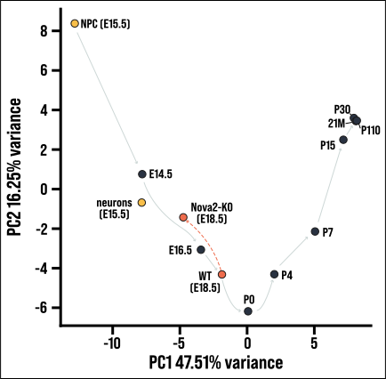
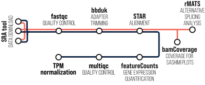

# Cortexa SplicePCA Example

In this tutorial, we will walk you through the process of analyzing your own files for the SplicePCA tool.

## Use SplicePCA

As a first step, to get familiar with the SplicePCA tool, you can use the analyzed files deposited in `data/`. These are control and *Nova2*-KD samples from the developing, embryonic neocortex. 

> Saito, Yuhki, et al. "Differential NOVA2-mediated splicing in excitatory and inhibitory neurons regulates cortical development and cerebellar function." *Neuron* 101.4 (2019): 707-720.

Once these files are downloaded, you can use them for the custom analysis in SplicePCA. 

1. Browse to [Cortexa's SplicePCA](https://cortexa-rna.com/pca)

2. Select relevant datasets for the PCA analysis – in this case **Development** and **NPC/neuron** could be a good choice

3. Upload the alternative splicing files by checking **Include own datasets**

4. Define the genes on which the analysis will be done
   a. To do the analysis on all available genes, select the option **Use all Genes**
   b. To define a subset of genes, enter the gene symbols in the **Add Gene** mask

5. Press **Start PCA**, the process can take a while.



*Result of SplicePCA using the Casette Exon ([SE.MATS.JCEC.txt](data/SE.MATS.JCEC.txt)) analyzed with **Development** and ***NPC/neuron** data and visualized after **Download PCA** with [matplotlib](https://matplotlib.org/).*

## Analyze your own files

In order to minimize technical effects, you should do the analysis as described in the manuscript.

**Tools**:

- [BBDuk (version 39.01)](https://sourceforge.net/projects/bbmap/files/BBMap_39.01.tar.gz/download):
   - [Installation](https://jgi.doe.gov/data-and-tools/software-tools/bbtools/bb-tools-user-guide/installation-guide/)
   - [Useage](https://jgi.doe.gov/data-and-tools/software-tools/bbtools/bb-tools-user-guide/bbduk-guide/) 
- [STAR (version 2.7.10b)](https://github.com/alexdobin/STAR/releases/download/2.7.11b/STAR_2.7.11b.zip)
   - [Installation](https://github.com/alexdobin/STAR?tab=readme-ov-file#compiling-from-source)
   - [Useage](https://github.com/alexdobin/STAR/blob/master/doc/STARmanual.pdf) 
- [rMATS turbo (version 4.1.2)](https://rnaseq-mats.sourceforge.io/rmats4.0.1/user_guide.htm)
   - [Installation](https://github.com/Xinglab/rmats-turbo?tab=readme-ov-file#build)
   - [Useage](https://github.com/Xinglab/rmats-turbo?tab=readme-ov-file#starting-with-bam-files) 

**Reference Genome**:
- [Gencode mm39](https://www.gencodegenes.org/mouse/release_M33.html)




*Analysis pipeline for alternative splicing*

# Cortexa SplicePCA Example

In this tutorial, we will walk you through the process of analyzing your own files for the SplicePCA tool.

## Use SplicePCA

[This section remains unchanged]

## Analyze your own files
> [!CAUTION]
> This is just a general outline of a pipeline and it has to be adapted to your parameters.

To minimize technical effects, you should perform the analysis as described in the manuscript. Follow these detailed steps to set up and run the analysis pipeline:

### 1. Install required tools

#### BBDuk (version 39.01)

1. Download BBDuk from [SourceForge](https://sourceforge.net/projects/bbmap/files/BBMap_39.01.tar.gz/download)
2. Extract the downloaded file:
   ```
   tar -xvzf BBMap_39.01.tar.gz
   ```
3. Add the BBDuk directory to your PATH:
   ```
   export PATH=$PATH:/path/to/bbmap
   ```

#### STAR (version 2.7.10b)

1. Download STAR from [GitHub](https://github.com/alexdobin/STAR/releases/download/2.7.11b/STAR_2.7.11b.zip)
2. Extract the ZIP file:
   ```bash
   unzip STAR_2.7.11b.zip
   ```
3. Compile STAR:
   ```bash
   cd STAR-2.7.11b/source
   make STAR
   ```
4. Add the STAR directory to your PATH:
   ```bash
   export PATH=$PATH:/path/to/STAR-2.7.11b/bin/Linux_x86_64
   ```

#### rMATS turbo (version 4.1.2)

1. Clone the rMATS-turbo repository:
   ```bash
   git clone https://github.com/Xinglab/rmats-turbo.git
   ```
2. Install dependencies (ensure you have Python 3.6+ and GCC installed):
   ```bash
   cd rmats-turbo
   ./build_rmats
   ```
3. Add the rMATS directory to your PATH:
   ```bash
   export PATH=$PATH:/path/to/rmats-turbo
   ```

### Samtools (version 1.18)
1. Download Samtools from [GitHub](https://github.com/samtools/samtools/releases/download/1.18/samtools-1.18.tar.bz2)
2. Extract Samtools
   ```bash
      tar -xvjf samtools-1.18.tar.bz2
   ```
3. Install Samtools
    ```bash
    cd samtools-1.18
   ./configure --prefix=/where/to/install
   make
   make install
    ```

### RSeQC (version 5.0.1)
1. Install RSeQC using pip
    ```bash
       pip install RSeQC
    ```

### 2. Prepare reference genome

1. Download Gencode mm39 from [Gencode](https://www.gencodegenes.org/mouse/release_M33.html)
   - Download the genome FASTA file and the GTF annotation file
2. Index the genome for STAR:
   ```bash
   STAR --runMode genomeGenerate --genomeDir /path/to/star_index \
        --genomeFastaFiles /path/to/GRCm39.primary_assembly.genome.fa \
        --sjdbGTFfile /path/to/gencode.vM33.annotation.gtf \
        --sjdbOverhang 100
   ```


### 3. Process raw data and perform analysis

Follow these steps for each sample:

1. Quality control with FastQC:

```bash
fastqc -o /path/to/fastqc_output -t <threads> sample_R1.fastq.gz sample_R2.fastq.gz
```

2. Adapter trimming with BBDuk:

```bash
bbduk.sh in1=sample_R1.fastq.gz in2=sample_R2.fastq.gz \
         out1=sample_trimmed_R1.fastq.gz out2=sample_trimmed_R2.fastq.gz \
         ref=/path/to/adapters.fa \
         ktrim=r k=23 mink=11 hdist=1 tpe tbo \
         qtrim=rl trimq=10 minlen=25
```

3. Alignment with STAR:

```bash
STAR --genomeDir /path/to/star_index \
     --readFilesIn sample_trimmed_R1.fastq.gz sample_trimmed_R2.fastq.gz \
     --readFilesCommand zcat \
     --outFileNamePrefix sample_ \
     --outSAMtype BAM SortedByCoordinate \
     --limitBAMsortRAM 10000000000 \
     --runThreadN <threads>

samtools index -@ <threads> sample_Aligned.sortedByCoord.out.bam
```

4. Infer strandedness with RSeQC:

```bash
infer_experiment.py -r /path/to/genome.bed -i sample_Aligned.sortedByCoord.out.bam > sample_strandedness.txt
```

5. Count features with FeatureCounts:

```bash
featureCounts -s <strandedness> \
              -p --countReadPairs \
              -t exon \
              -g gene_name \
              -T <threads> \
              -a /path/to/gencode.vM33.annotation.gtf \
              -o sample_counts.tab \
              sample_Aligned.sortedByCoord.out.bam
```

6. Perform alternative splicing analysis with rMATS:

```bash
rmats.py --b1 sample1_Aligned.sortedByCoord.out.bam,sample2_Aligned.sortedByCoord.out.bam \
         --gtf /path/to/gencode.vM33.annotation.gtf \
         --od /path/to/rmats_output \
         --tmp /path/to/rmats_tmp \
         -t paired \
         --libType <strandedness> \
         --readLength <read_length> \
         --nthread <threads>
```

### 4. Adjust parameters

Ensure you adjust the following parameters according to your experimental setup:

- `<threads>`: Number of threads to use for various processes
- `<strandedness>`: Strandedness information (0 for unstranded, 1 for stranded, 2 for reversely stranded)
- `<read_length>`: Read length of your sequencing data

### 5. Prepare files for SplicePCA

Use the `SE.MATS.JCEC.txt` file from the rMATS output for upload to SplicePCA.

### 6. Analyze with SplicePCA

Follow the steps in the "Use SplicePCA" section to upload and analyze your processed files.


## Hot to Cite

> Weißbach, Stephan, et al. "Cortexa – a comprehensive resource for studying gene expression and alternative splicing in the murine brain." *biorxiv* (2024).

and the data sets that you used, which can be found at [Cortexa - About the data](https://cortexa-rna.com/about).
