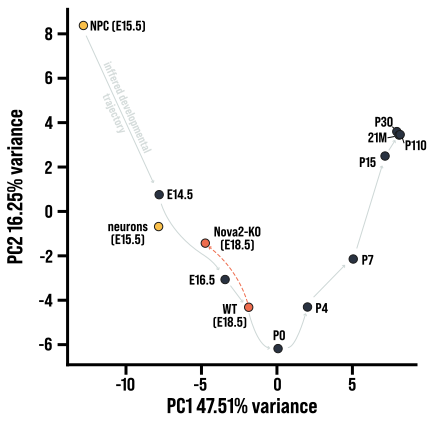
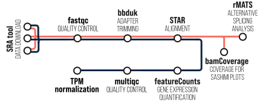

# Cortexa SplicePCA Example

In this tutorial, we will walk you through the process of analyzing your own files for the SplicePCA tool.

## Use SplicePCA

As a first step, to get familiar with the SplicePCA tool, you can use the analyzed files deposited in `data/`. These are control and *Nova2*-KD samples from the developing, embryonic neocortex. 

> Saito, Yuhki, et al. "Differential NOVA2-mediated splicing in excitatory and inhibitory neurons regulates cortical development and cerebellar function." *Neuron* 101.4 (2019): 707-720.

Once these files are downloaded, you can use them for the custom analysis in SplicePCA. 

1. Browse to [Cortexa's SplicePCA]([Cortexa](https://cortexa-rna.com/pca)) 

2. Select relevant datasets for the PCA analysis – in this case **Development** and **NPC/neuron** could be a good choice

3. Upload the alternative splicing files by checking **Include own datasets**

4. Define the genes on which the analysis will be done
   a. To do the analysis on all available genes, select the option **Use all Genes**
   b. To define a subset of genes, enter the gene symbols in the **Add Gene** mask

5. Press **Start PCA**, the process can take a while.

*Result of SplicePCA using the Casette Exon ([SE.MATS.JCEC.txt](data/SE.MATS.JCEC.txt)) analyzed with **Development** and ***NPC/neuron** data and visualized after **Download PCA** with [matplotlib](https://matplotlib.org/).*

## Analyze your own files

In order to minimize technical effects, you should do the analysis as described in the manuscript.

**Tools**:

- [BBDuk (version 39.01)]([Download BBMap_39.01.tar.gz (BBMap)](https://sourceforge.net/projects/bbmap/files/BBMap_39.01.tar.gz/download))

- [STAR (version 2.7.10b)](https://github.com/alexdobin/STAR/releases/download/2.7.11b/STAR_2.7.11b.zip)

- [rMATS turbo (version 4.1.2)]([User Guide](https://rnaseq-mats.sourceforge.io/rmats4.0.1/user_guide.htm))

**Reference Genome**:

- [Gencode mm39]([GENCODE - Mouse Release M33](https://www.gencodegenes.org/mouse/release_M33.html))

*Analysis pipeline for alternative splicing*

## Hot to Cite

Weißbach, Stephan, et al. "Cortexa – a comprehensive web-portal for gene expression and alternative splicing of the murine neocortex and hippocampus." *biorxiv* (2024).
